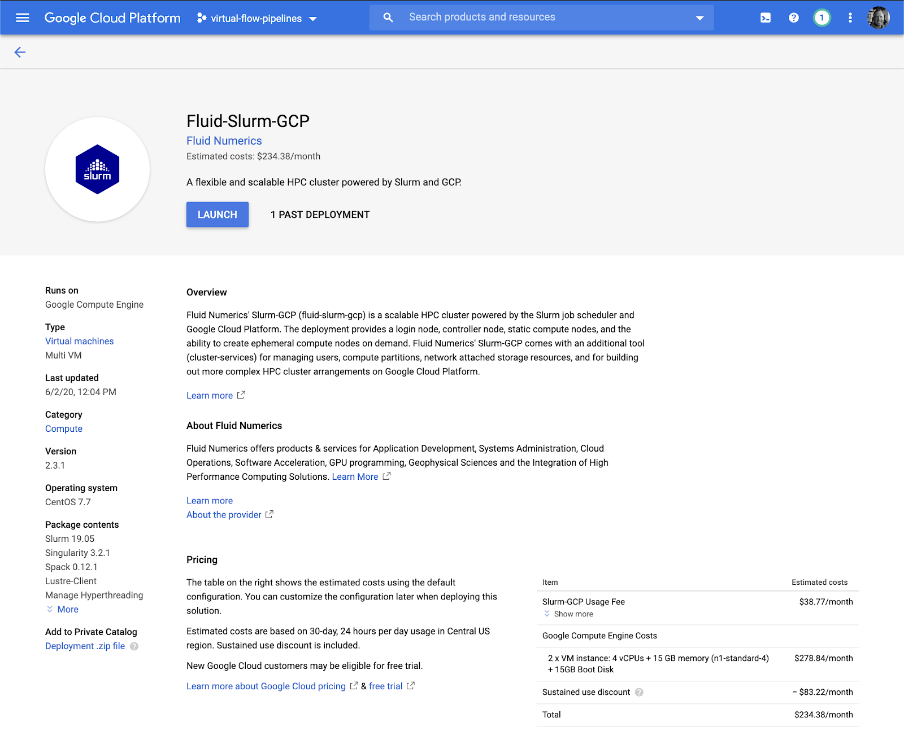
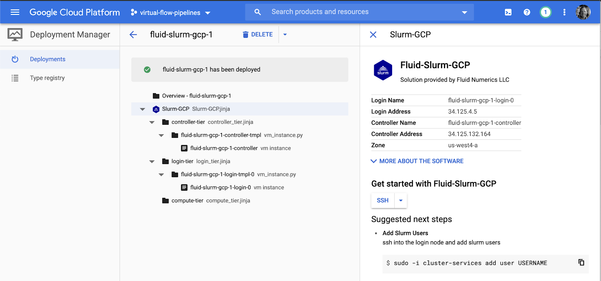
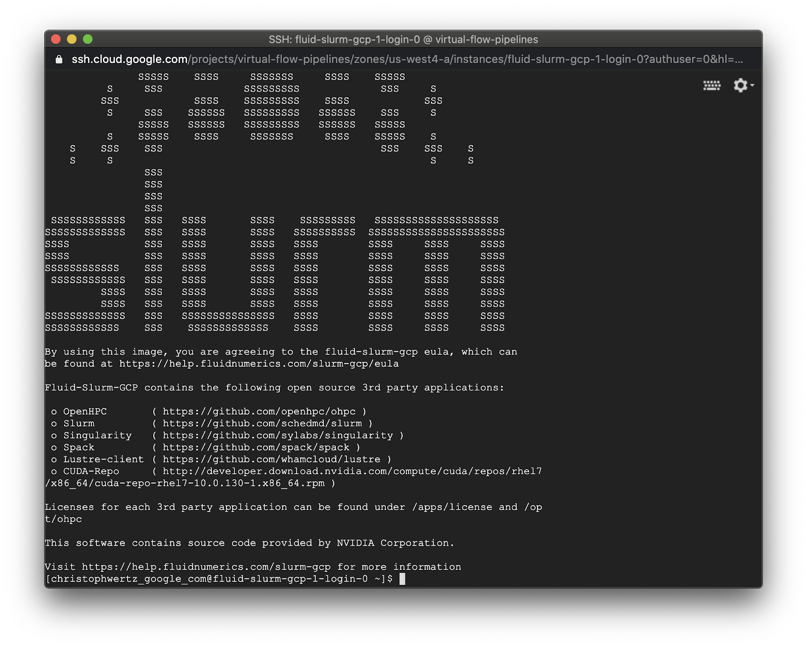
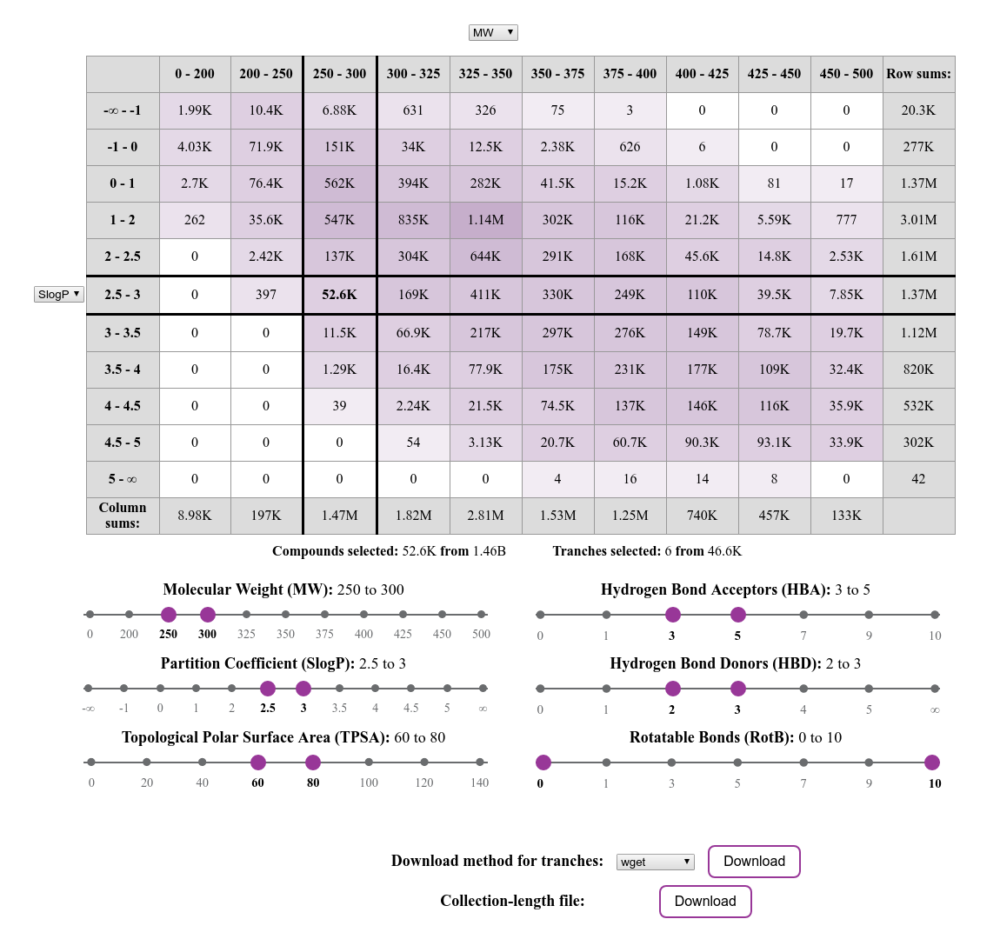
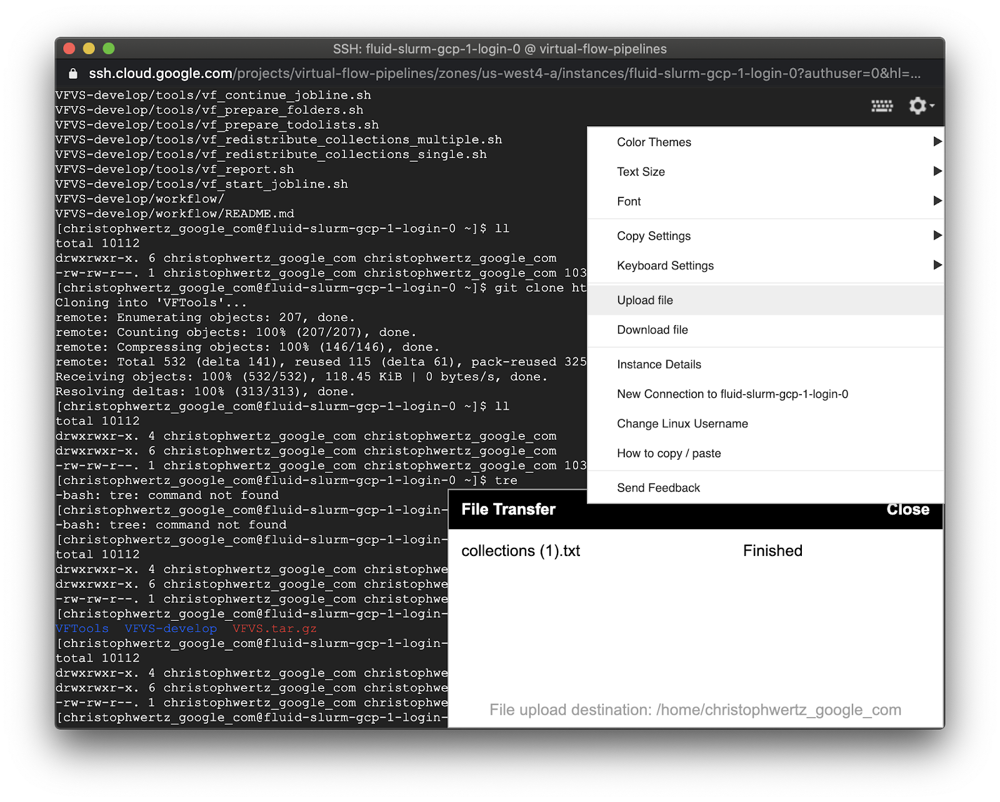

# Table of Contents

- [Deploy Slurm Cluster](#deploy-slurm-cluster)
- [Install VirtualFlow](#install-virtualflow)
- [Setting Up the Workflow](#setting-up-the-workflow)
- [Preparing the Docking Input Files](#preparing-the-docking-input-files)
- [Preparing the Tools Folder](#preparing-the-tools-folder)
- [Using Entire Nodes](#using-entire-nodes)
- [Workflow Settings](#workflow-settings)
- [Docking Scenario Settings](#docking-scenario-settings)
- [Prepare the Job File](#prepare-the-job-file)
- [Prepare the Workflow and Output-Files Folders](#prepare-the-workflow-and-output-files-folders)
- [Starting the Workflow](#starting-the-workflow)
- [Watch the Workflow Run](#watch-the-workflow-run)


# Deploy Slurm Cluster

* Search for SLURM in [GCP Marketplace](https://console.cloud.google.com/marketplace/)


* Select "Fluid-Slurm-GCP"



* Configure
  * Slurm Login Node
    * Default: 1 instance, n1-standard-4
  * Slurm Controller Node
    * Default: n1-standard-4
  * Slurm Default Compute Partition
    * Default: 10 instances, n1-standard-64 → CHANGE: n1-standard-8 (e2-standard-8?)
    * Partition Name: partition-1

* Deploy



# Install VirtualFlow

* SSH into the SLURM Login Node



* Install VirtualFlow for Virtual Screening (VFVS)
  * wget -O VFVS.tar.gz [https://github.com/VirtualFlow/VFVS/archive/develop.tar.gz](https://github.com/VirtualFlow/VFVS/archive/develop.tar.gz)
  * tar -xvf VFVS_GK.tar
  * git clone [https://github.com/VirtualFlow/VFTools](https://github.com/VirtualFlow/VFTools)

```
[user_google_com@fluid-slurm-gcp-1-login-0 ~]$ ls -l
total 10112
drwxrwxr-x. 4 user_google_com user_google_com      128 Jun  2 20:48 VFTools
drwxrwxr-x. 6 user_google_com user_google_com      173 Apr 23 14:50 VFVS-develop
-rw-rw-r--. 1 user_google_com user_google_com 10351453 Jun  2 20:47 VFVS.tar.gz
```

# Setting Up the Workflow

* VirtualFlow Virtual Screening [tutorial](https://docs.virtual-flow.org/tutorials/-LdE94b2AVfBFT72zK-v/tutorial-2-vfvs-scratch/introduction)
* The target structure in this tutorial is human glucokinase (GK)
 
The files in this tutorial come with two pre-configured docking scenarios:

1. [QuickVina 2](https://academic.oup.com/bioinformatics/article/31/13/2214/195750) with exhaustiveness set to 8
1. [Smina Vinardo](https://journals.plos.org/plosone/article?id=10.1371/journal.pone.0155183) with exhaustiveness set to 4

The REAL database of Enamine contains over 1.4 billion commercially available on-demand molecules.

* [https://virtual-flow.org/real-library](https://virtual-flow.org/real-library)



* Set Parameters
  * Set Molecular Weight: 250 - 300
  * Set Partition Coefficient: 2.3-3
  * Set Topological Polar Surface Area: 60-80
  * Set Hydrogen Bond Acceptors: 3-5
  * Set Hydrogen Bond Donors: 2-3
  * Set Rotatable Bonds: 0-10

* Download method for tranches: “wget”
  * Click “download” → tranches.sh

* Collection-length file
  * Click “download” → collections.txt

SSH into SLURM Login Node
T


Upload files to SLURM Login Node
* tranches.sh
* collections.txt



Replace the file tools/templates/todo.all with the file collections.txt

```
[user@machine ~]$ cp collections.txt VFVS-develop/tools/templates/todo.all
```

* Move the file tranches.sh into VFVS_GK/input-files/ligand-library
* Change to that directory
* Source the tranches file

```
[user@machine ~]$ mv tranches.sh VFVS-develop/input-files/ligand-library/
[user@machine ~]$ cd VFVS-develop/input-files/ligand-library/
[user@machine ligand-library]$ source tranches.sh 
```

# Preparing the Docking Input Files

* Change to input-files directory

```
[user@machine ligand-library]$ cd ..
[user@machine input-files]$ 

```

* Download docking input files

```
[user@machine input-files]$ wget https://virtual-flow.org/sites/virtual-flow
.org/files/tutorials/docking_files.tar.gz
[user@machine input-files]$  tar -xvzf docking_files.tar.gz
smina_rigid_receptor1/config.txt
receptor/4no7_prot.pdbqt
qvina02_rigid_receptor1/config.txt
smina_rigid_receptor1/
receptor/
qvina02_rigid_receptor1/
[user@machine input-files]$
```

# Preparing the Tools Folder

* Prepare the tools folder

```
[user@machine input-files]$ cd ../tools/
```

* Edit the file _tools/templates/all.ctrl_
  * _batchsystem_: The resource manager which is used by your cluster.
  * _partition_: The partition queue to be used for running the jobs of this workflow/tutorial.
  * _timelimit_: Each partition/queue has normally a time-limit, therefore make sure you don't exceed it.
  
```
[user_google_com@fluid-slurm-gcp-1-login-0 ~]$ vi VFVS-develop/tools/templates/all.ctrl
```

* The _batchsystem_ should already be set to SLURM:

```
batchsystem=SLURM
# Possible values: SLURM, TORQUE, PBS, LSF, SGE
# Settable via range control files: No
```

* Set _partition_ to match the deployment partition name given above:
* Change _“shared”_ to _“partition-1”_ or whatever you named your partition in the deployment

```
partition=partition-1
# Partitions are also called queues in some batchsystems
# Settable via range control files: Yes
```

* Set _timelimit_ (no change):

```
timelimit=7-00:00:00
# Format for slurm: dd-hh:mm:ss
# Format for TORQUE and PBS: hh:mm:ss
# Format for SGE: hh:mm:ss
# Format for LSF: hh:mm
# For all batchsystems: always fill up with two digits per field (used be the job scripts)
# Settable via range control files: Yes
```

# Using Entire Nodes

* Set the number of nodes which should be used per job, and number of cpus per node.  It was set to 10 x n1-standard-8 in the deployment above.

```
steps_per_job=10
# Not (yet) available for LSF and SGE (is always set to 1)
# Should not be changed during runtime, and be the same for all joblines
# Settable via range control files: Yes

cpus_per_step=8
# Sets the slurm cpus-per-task variable (task = step) in SLURM
# In LSF this corresponds to the number of slots per node
# Should not be changed during runtime, and be the same for all joblines
# Not yet available for SGE (always set to 1)
# Settable via range control files: Yes

queues_per_step=8  ← Same as ”cpus_per_step”
# Sets the number of queues/processes per step
# Should not be changed during runtime, and be the same for all joblines
# Not yet available for SGE (always set to 1)
# Settable via range control files: Yes
```

# Workflow Settings

* Set ```ligands_todo_per_queue``` and ```ligands_per_refilling_step```:

```
ligands_todo_per_queue=1000
ligands_per_refilling_step=1000
```

* Enable full logging when trying to get a workflow working:

```
verbosity_logfiles=debug
store_queue_log_files=all_uncompressed
```

# Docking Scenario Settings

* Configure the docking scenario settings:

```
docking_scenario_names=qvina02_rigid_receptor1:smina_rigid_receptor1
docking_scenario_programs=qvina02:smina_rigid
docking_scenario_replicas=1:1
docking_scenrio_inputfolders=../input-files/qvina02_rigid_receptor1:../input-files/smina_rigid_receptor1
```

# Prepare the Job File

* Job file is in tools/templates.
* Should not need to be edited.

```
[user@machine ~]$ ls VFVS-develop/tools/templates/template1.slurm.sh
VFVS-develop/tools/templates/template1.slurm.sh
```

# Prepare the ```Workflow``` and ```output-files``` Folders

```
[user@machine ~]$ cd VFVS-develop/tools/
[user@machine tools]$ ./vf_prepare_folders.sh

Do you really wish prepare/reset the output-files folder? y

 * Preparing the output-files folder...

Do you really wish to prepare/reset the workflow folder? y

 * Preparing the workflow folder...

The templates were copied.

[user@fluid-slurm-gcp-1-login-0 tools]$ 
```

# Starting the Workflow

* Add your login as a user of the slurm cluster

```
[user_domain_com@fluid-slurm-gcp-1-login-0 tools]$ sudo su
[root@fluid-slurm-gcp-1-login-0 tools]# cluster-services add user user_domain_com
 Adding User(s)
  user_domain_com
 Associations =
  U = user_domain_com A = default    C = fluid-slur
 Non Default Settings
[root@fluid-slurm-gcp-1-login-0 tools]# exit
exit
[user_domain_com@fluid-slurm-gcp-1-login-0 tools]$
```

* Start the workflow:

```
[user_domain_com@fluid-slurm-gcp-1-login-0 tools]$ ./vf_start_jobline.sh 1 10 templates/template1.slurm.sh submit 1


::  ::  ::  ::::. :::::: ::  ::  .::::.  ::      :::::  ::    .::::. ::      ::
::  ::  ::  :: ::   ::   ::  ::  ::  ::  ::      ::     ::    ::  :: ::  ::  ::
 ::::   ::  :::.    ::   ::  ::  ::::::  ::      :::::  ::    ::  ::  ::::::::
  ::    ::  :: ::   ::    ::::   ::  ::  ::::    ::     ::::: '::::'   ::  ::


Syncing the jobfile of jobline 1 with the controlfile file ../../workflow/control/all.ctrl.
Syncing the jobfile of jobline 2 with the controlfile file ../../workflow/control/all.ctrl.
Syncing the jobfile of jobline 3 with the controlfile file ../../workflow/control/all.ctrl.
Syncing the jobfile of jobline 4 with the controlfile file ../../workflow/control/all.ctrl.
Syncing the jobfile of jobline 5 with the controlfile file ../../workflow/control/all.ctrl.
Syncing the jobfile of jobline 6 with the controlfile file ../../workflow/control/all.ctrl.
Syncing the jobfile of jobline 7 with the controlfile file ../../workflow/control/all.ctrl.
Syncing the jobfile of jobline 8 with the controlfile file ../../workflow/control/all.ctrl.
Syncing the jobfile of jobline 9 with the controlfile file ../../workflow/control/all.ctrl.
Syncing the jobfile of jobline 10 with the controlfile file ../../workflow/control/all.ctrl.

Submitted batch job 2
The job for jobline 1 has been submitted at Fri Jun  5 19:00:49 UTC 2020.

Submitted batch job 3
The job for jobline 2 has been submitted at Fri Jun  5 19:00:50 UTC 2020.

Submitted batch job 4
The job for jobline 3 has been submitted at Fri Jun  5 19:00:51 UTC 2020.

Submitted batch job 5
The job for jobline 4 has been submitted at Fri Jun  5 19:00:52 UTC 2020.

Submitted batch job 6
The job for jobline 5 has been submitted at Fri Jun  5 19:00:53 UTC 2020.

Submitted batch job 7
The job for jobline 6 has been submitted at Fri Jun  5 19:00:54 UTC 2020.

Submitted batch job 8
The job for jobline 7 has been submitted at Fri Jun  5 19:00:55 UTC 2020.

Submitted batch job 9
The job for jobline 8 has been submitted at Fri Jun  5 19:00:56 UTC 2020.

Submitted batch job 10
The job for jobline 9 has been submitted at Fri Jun  5 19:00:57 UTC 2020.

Submitted batch job 11
The job for jobline 10 has been submitted at Fri Jun  5 19:00:58 UTC 2020.

[user_domain_com@fluid-slurm-gcp-1-login-0 tools]$
```

# Watch the Workflow Run

```
[user_domain_com@fluid-slurm-gcp-1-login-0 tools]$ cd /home/user_domain_com/VFVS-develop/tools/; watch ./vf_report.sh -c workflow -v 2

::  ::  ::  ::::. :::::: ::  ::  .::::.  ::      :::::  ::    .::::. ::      ::
::  ::  ::  :: ::   ::   ::  ::  ::  ::  ::      ::     ::    ::  :: ::  ::  ::
 ::::   ::  :::.    ::   ::  ::  ::::::  ::      :::::  ::    ::  ::  ::::::::
  ::    ::  :: ::   ::    ::::   ::  ::  ::::    ::     ::::: '::::'   ::  ::

                                  Fri Jun  5 19:03:39 UTC 2020                                       

                                         Workflow Status                                        
::::::::::::::::::::::::::::::::::::::::::::::::::::::::::::::::::::::::::::::::::::::::::::::::
                                             Joblines    
................................................................................................

 Number of jobfiles in the workflow/jobfiles/main folder: 10
 Number of joblines in the batch system: 10
 Number of joblines in the batch system currently running: 0
  * Number of joblines in queue "partition" currently running: 0
 Number of joblines in the batch system currently not running: 10
  * Number of joblines in queue "partition" currently not running: 10
 Number of cores/slots currently used by the workflow: 0

                                            Collections    
................................................................................................

 Total number of ligand collections: 93
 Number of ligand collections completed: 0
 Number of ligand collections in state "processing": 0
 Number of ligand collections not yet started: 93

                                 Ligands (in completed collections)   
................................................................................................

 Total number of ligands: 101724
 Number of ligands started: 0
 Number of ligands successfully completed: 0
 Number of ligands failed: 0

                                Dockings (in completed collections)   
................................................................................................

 Docking runs per ligand: 2
 Number of dockings started: 0
 Number of dockings successfully completed: 0
 Number of dockings failed: 0

[user_domain_com@fluid-slurm-gcp-1-login-0 tools]$ 

Check Docking results (run this command from tutorial): ./vf_report.sh -c vs -d qvina02_rigid_receptor1 -n 10
```
