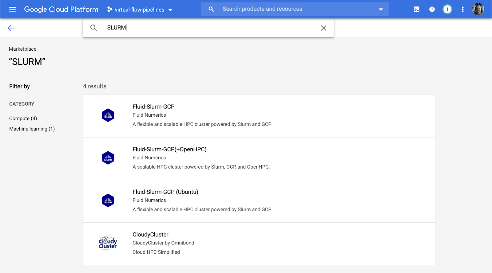

# Table of Contents

- [Deploy Slurm Cluster](#deploy-slurm-cluster)
- [Install VirtualFlow](#install-virtualflow)
- [Setting Up the Workflow](#setting-up-the-workflow)
- [Preparing the Docking Input Files](#preparing-the-docking-input-files)
- [Preparing the tools Folder](#preparing-the-tools-folder)
- [Using Entire Nodes](#using-entire-nodes)
- [Workflow Settings](#workflow-settings)
- [Docking Scenario Settings](#docking-scenario-settings)
- [Prepare the Job File](#prepare-the-job-file)

# Deploy Slurm Cluster

* Search for SLURM in <a href="https://console.cloud.google.com/marketplace/" target="_blank">GCP Marketplace</a>: 



* Select "Fluid-Slurm-GCP"


* Configure
  * Slurm Login Node
    * Default: 1 instance, n1-standard-4
  * Slurm Controller Node
    * Default: n1-standard-4
  * Slurm Default Compute Partition
    * Default: 10 instances, n1-standard-64 → CHANGE: n1-standard-8 (e2-standard-8?)
    * Partition Name: partition-1

* Deploy


# Install VirtualFlow

* SSH into the SLURM Login Node


* Install VirtualFlow for Virtual Screening (VFVS)
  * wget -O VFVS.tar.gz <a href="https://github.com/VirtualFlow/VFVS/archive/develop.tar.gz" target="_blank">https://github.com/VirtualFlow/VFVS/archive/develop.tar.gz</a>
  * tar -xvf VFVS_GK.tar
  * git clone <a href="https://github.com/VirtualFlow/VFTools" target="_blank">https://github.com/VirtualFlow/VFTools</a>

```
[user_google_com@fluid-slurm-gcp-1-login-0 ~]$ ls -l
total 10112
drwxrwxr-x. 4 user_google_com user_google_com      128 Jun  2 20:48 VFTools
drwxrwxr-x. 6 user_google_com user_google_com      173 Apr 23 14:50 VFVS-develop
-rw-rw-r--. 1 user_google_com user_google_com 10351453 Jun  2 20:47 VFVS.tar.gz
```

# Setting Up the Workflow

# Preparing the Docking Input Files

# Preparing the tools Folder

# Using Entire Nodes

# Workflow Settings

# Docking Scenario Settings

# Prepare the Job File
